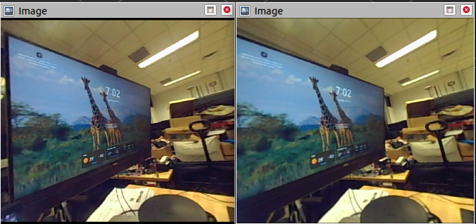

## Unitree Camera ROS Driver

The ROS wrapper for unitree SV1-25 Camera.

### Usage

```sh
cd sdk
git clone https://github.com/unitreerobotics/UnitreecameraSDK.git
```

In your `YOUR_CATKIN_WS`, run `catkin_make` or `catkin build`. Then, run

```sh
roslaunch unitree_camera unitree_SV1_25.launch
```

You could see `/camera/infra1/image_rect_raw` and `/camera/infra2/image_rect_raw` stereo image topics. If you would like to change the parameter in the launch file.



### TODO

- [ ] To support raw image message
- [ ] To support depth message